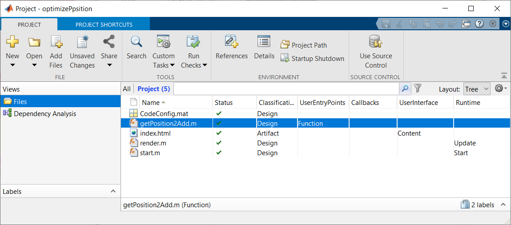

# MATLAB -> C++ -> WebAssembly の自動変換を使った非線形最適化 on JavaScript
# 0. はじめに


MATLAB Central で Generate JavaScript Using MATLAB Coder なるツールを見つけました。MATLAB Coder を使って MATLAB から C++ に変換した後、さらに WebAssembly にまでもっていくツールのようです。今まで JavaScript は触ってこなかったですが、自動で変換できるならやってみるか・・と遊んでみた話。


  


WebAssembly については以下の２記事が参考になりました。


   -  [Qiita: WebAssemblyとは](https://qiita.com/ShuntaShirai/items/3ac92412720789576f22) 
   -  [Qiita: WebAssemblyとは？- 実際にC言語をブラウザで動かす-【2019年6月版】](https://qiita.com/umamichi/items/c62d18b7ed81fdba63c2) 


WebAssembly はプログラムをブラウザで高速実行するためのバイナリとして、JavaScript から呼び出す形で利用されるとのこと。部分的な処理の高速化、C/C++等の他言語で書かれた既存アプリを移植するのに有効そうです。


  
# やったこと


以前 Qiita にも投稿したネタ（[【MATLAB \& Python】最適化計算と Google Sheets の読み書き](https://qiita.com/eigs/items/4182fcd9b5da748ef77e)）ですが。


**「バランスが崩れた保有割合を目標割合に近づけるためには各銘柄を何株買えばいいのか」**


にします。以前の投稿ではこの計算を MATLAB の fmincon と Google Sheets + Python を使ってやりましたが、今回はブラウザ上で完結させようというのが最終的な狙いですが、まずは MATLAB の fmincon の非線形最適化計算を JavaScript で実行させる部分をまとめます。UI はもう少し勉強が必要そうなのでまた後日。


  


基本的には Generate JavaScript Using MATLAB Coder で用意されている  [例題: Pass Data to a Library](https://viewer.mathworks.com/?viewer=live_code&url=https%3A%2F%2Fjp.mathworks.com%2Fmatlabcentral%2Fmlc-downloads%2Fdownloads%2Fbd0e1def-822e-40bc-8a7f-5842c7197c5e%2Fe7abd4d2-be59-4ad2-858e-3f1046727acf%2Ffiles%2Fexamples%2FcreateLibrary%2FPassingDataArray.mlx&embed=web) の流れに沿って作業しています。


  


MATLAB ヘビーユーザーにはメモリの取り扱い方がトリッキーでした。。


  


コードこちらから： [GitHub: minoue-xx/MATLAB2WASM_sample](https://github.com/minoue-xx/MATLAB2WASM_sample)


実行ページはこちら：[Github Pages: MATLAB2WASM_sample](https://minoue-xx.github.io/MATLAB-to-WebAssembly-sample/)（何も目には見えませんが）


  
## 環境

   -  MATLAB (R2019b2) 
   -  Optimization Toolbox 
   -  MATLAB Coder 
   -  [File Exchange: Generate JavaScript Using MATLAB Coder](https://jp.mathworks.com/matlabcentral/fileexchange/69973-generate-javascript-using-matlab-coder) v2.0.2 
   -  [Emscripten Development Kit](https://emscripten.org/index.html) v1.39.1 
   -  Google Chrome 

# 1. ツールの設定


File Exchange から [Generate JavaScript Using MATLAB Coder](https://jp.mathworks.com/matlabcentral/fileexchange/69973-generate-javascript-using-matlab-coder) をインストール。まず開く `Setup.mlx` に従って Emscripten Development Kit の最新版をインストールします。ネットワークフォルダだとうまくいかなかったので、ローカルにインストールください。


  
# 2. MATLAB Project 作成


Generate JavaScript Using MATLAB Coder では [MATLAB Project](https://jp.mathworks.com/help/matlab/projects.html) を使用します。


作業フォルダに移動して、以下を実行。出力形式は Dynamic Libeary (dll) です。


```matlab
proj = webcoder.setup.project("optimizePosition","Directory",pwd,"OutputType",'dll');
```
  
# 3. MATLAB 関数作成


非線形最適化を実施する関数 `getPosition2Add.m` を作ります。内容は [Qiita:【MATLAB \& Python】最適化計算と Google Sheets の読み書き](https://qiita.com/eigs/items/4182fcd9b5da748ef77e) で紹介したものとほぼ同じですが、コード生成用に入力引数のサイズ・データ型を明示します。コード全文はこちら： [GitHub](https://github.com/minoue-xx/MATLAB2WASM_sample)


  
```matlab
% getPosition2Add.m(一部)
function xlong = getPosition2Add(target_pf, price, position)

% Specify the Dimensions and Data Types
assert(isa(target_pf, 'double'));
assert(isa(price, 'double'));
assert(isa(position, 'double'));
assert(all( size(target_pf) == [ 1, 10 ]))
assert(all( size(price) == [ 1, 10 ]))
assert(all( size(position) == [ 1, 10 ]))

%(以下略)
```
  


ここでは最大10銘柄まで対応する想定で入力配列サイズを 1x10 のベクトルとしてコード生成します。


MATLAB Coder 自体は「配列サイズは最大10まで」という設定も可能なんですが、なぜか WebAssembly までもっていくとメモリエラーがでました。原因は調査中。関数ができたら、`getPosition2Add.m` をプロジェクトに追加して、ラベルを UserEntryPoints > Function に設定しておきます。





  


こんな感じ。


  
# 4. JavaScript と WebAssembly の生成


以下のコードで MATLAB Project からビルドします。裏で MATLAB Coder + Emscripten SDK が走っている模様。


```matlab
proj = openProject(pwd);
webcoder.build.project(proj);
```


C++ コードが build フォルダに出力されます。さらに、この C++ コードが `optimizeposition.js` と `optimizeposition.wasm` にコンパイルされて、dist フォルダに出力されます。


  
# 5. HTML/JavaScript から呼び出し


さて、ようやく本題。MDN によると


  


JavaScript typed arrays are array-like objects and provide a mechanism for accessing raw binary data.


  


とのことで、この JavaScript typed arrays を使って、JavaScript から optimizeposition.wasm とデータをやり取りします。


  
## 処理の流れ

   1.  JavaScript typed array を作成 
   1.  typed array の要素数から必要な領域を計算、wasm 側のメモリを確保 
   1.  確保した領域に typed array の値をコピー 
   1.  wasm 側の計算処理を実行 
   1.  wasm 側のメモリから typed array に値をコピー 
   1.  不要になった領域を解放 


1-3 の処理をしているのが `_arrayToHeap`、5 が `_heapToArray `です。処理の詳細は [Guthub: Planeshifter/emscripten-examples](https://github.com/Planeshifter/emscripten-examples/tree/master/01_PassingArrays) の README.md の記述が参考になります。


  
```matlab
script.js
    // JavaScript Array to Emscripten Heap
    function _arrayToHeap(typedArray) {
        var numBytes = typedArray.length * typedArray.BYTES_PER_ELEMENT;
        var ptr = Module._malloc(numBytes);
        var heapBytes = new Uint8Array(Module.HEAPU8.buffer, ptr, numBytes);
        heapBytes.set(new Uint8Array(typedArray.buffer));
        return heapBytes;
    }
    // Emscripten Heap to JavasSript Array
    function _heapToArray(heapBytes, array) {
        return new Float64Array(
            heapBytes.buffer,
            heapBytes.byteOffset,
            heapBytes.length / array.BYTES_PER_ELEMENT);
    }
    // Free Heap
    function _freeArray(heapBytes) {
        Module._free(heapBytes.byteOffset);
    }
    // Example of Passing Data Arrays
    var Module = {
        onRuntimeInitialized: function () {
            var target_pf = [0.275, 0.125, 0.2, 0.1, 0.1, 0.15, 0.05, 0, 0, 0];
            var price = [155.83, 90.4, 42.78, 42.50, 142.56, 112.93, 39.23, 0, 0, 0];
            var position = [12, 20, 40, 15, 6, 18, 12, 0, 0, 0];
            // Create Data    
            var Target_pf = new Float64Array(target_pf);
            var Price = new Float64Array(price);
            var Position = new Float64Array(position);
            var Position2Add = new Float64Array(10);
            // Move Data to Heap
            var Target_pfbytes = _arrayToHeap(Target_pf);
            var Pricebytes = _arrayToHeap(Price);
            var Positionbytes = _arrayToHeap(Position);
            var Position2Addbytes = _arrayToHeap(Position2Add);
            // Run Function
            Module._optimizeposition_initialize();
            Module._getPosition2Add(Target_pfbytes.byteOffset, Pricebytes.byteOffset, Positionbytes.byteOffset, Position2Addbytes.byteOffset)
            Module._optimizeposition_terminate();
            //  Copy Data from Heap
            Position2Add = _heapToArray(Position2Addbytes, Position2Add);
            var position2add = Array.from(Position2Add);
            // Free Data from Heap
            _freeArray(Target_pfbytes);
            _freeArray(Pricebytes);
            _freeArray(Positionbytes);
            _freeArray(Position2Addbytes);
            // Display Results
            console.log(position + " + " + position2add);
        }
    };
```
  
## 6. さて結果をみてみよう


ローカルサーバを立てて結果をみてみます。Fetch API は file URI Scheme をサポートしていないため、ファイルに http URI Scheme でアクセスできるようにする必要があるらしい。Generate JavaScript Using MATLAB Coder には関数が用意されてますのでこれを使います。


  


先ほど `.js` と `.wasm` が出力されたフォルダ dist に index.html を置きます。MATLAB 上で dist をカレントフォルダにして、


  
```matlab
server = webcoder.utilities.DevelopmentServer("Port",8125)
start(server);
web('http://localhost:8125')
% サーバを落とすときは
% stop(server);
```


Chrome で開いて [Ctrl] + [Shift] + [i] で以下の通り。[Github Pages: MATLAB2WASM_sample](https://minoue-xx.github.io/MATLAB2WASM_sample/) でも確認できます。


  


計算はできている模様。


  


同じ計算を MATLAB で試しに実行してみると、


  
```matlab
target_pf = [0.275, 0.125, 0.2, 0.1, 0.1, 0.15, 0.05, 0, 0, 0];
price = [155.83, 90.4, 42.78, 42.50, 142.56, 112.93, 39.23, 0, 0, 0];
position = [12, 20, 40, 15, 6, 18, 12, 0, 0, 0];
xlong = getPosition2Add(target_pf, price, position)
```


で


```matlab
xlong =
  Columns 1 through 9
     7     0     9     8     0     0     0     0     0
  Column 10
     0
```


となり、同じ結果であることが分かります。めでたしめでたし。


  
# まとめ


ひとまず MATLAB で書いた最適化計算が JavaScript から正しく呼び出せていることが確認できました。


  


株価 `price` や保有数 `position` の値も配列サイズも決め打ちな状況で、結果もコンソールに表示するだけですので、現状ではまだ使い物になりません。UI周りのお化粧は後ほどやってみる予定です。


  
## 参考

   -  [Qiita: 数独ソルバーで使うことでEmscriptenの仕組みを調べてみた](https://qiita.com/bellbind/items/c37183dd4b7eb9949b9a) 
   -  [【WebAssembly】JS側で作成したtyped arrayをwasm側に渡す](http://blog.shogonir.jp/entry/2017/05/23/232600) 
   -  [Guthub: Planeshifter/emscripten-examples](https://github.com/Planeshifter/emscripten-examples/tree/master/01_PassingArrays) 
   -  [MDN Web docs: JavaScript typed arrays](https://developer.mozilla.org/en-US/docs/Web/JavaScript/Typed_arrays) 
   -  [WebAssembly 開発環境構築の本：WebAssembly 入門](https://wasm-dev-book.netlify.com/hello-wasm.html) 


特に [【WebAssembly】JS側で作成したtyped arrayをwasm側に渡す](http://blog.shogonir.jp/entry/2017/05/23/232600)で公開されている多数の例題も大変貴重だと思います。助かりました。ありがとうございます。


# Appendix 1. getPosition2Add.m
```matlab
function xlong = getPosition2Add(target_pf, price, position)

% Specify the Dimensions and Data Types
assert(isa(target_pf, 'double'));
assert(isa(price, 'double'));
assert(isa(position, 'double'));
assert(all( size(target_pf) == [ 1, 10 ]))
assert(all( size(price) == [ 1, 10 ]))
assert(all( size(position) == [ 1, 10 ]))

idx = target_pf > 0;
target_pf = target_pf(idx);
price = price(idx);
position = position(idx);
N = sum(idx);

% それぞれの銘柄いくつ購入すればターゲットとする保有割合に近づくかを求めます。 その際の制約は Cost：合計何ドルまでの購入とするか ここでは 2k
% (約 20万円）とします。

Cost = 2e3; % $2k

% 線形不等式制約（合計コストが Cost 以下）
A = price;
b = Cost;
% 線形等式制約はなし
Aeq = [];
beq = [];
% 購入数の上下限
lb = zeros(1,N);
ub = inf(1,N);
% 初期値は 0。
x0 = zeros(1,N);

options = optimoptions('fmincon','Algorithm','sqp');

% 目的関数は getDiff で定義されています。
% ターゲットの保有割合との誤差二乗和平方根を最小とすることを目指します。
objfun = @(x2add) getDiff(x2add,price,position,target_pf);
x = fmincon(objfun,x0,A,b,Aeq,beq,lb,ub,[],options);

% fmincon を使用
% 本来は整数問題ですが実数で株数を求めた後、端数は無視します。
% 購入株数が多ければそこまで問題にはならないため。
% もちろん購入株数が少ない場合は影響があるため調整は行っているみたいですが、
% この方法はロボアドバイザー THEO も同じ（要引用）
% 購入株数の小数点以下切り捨て
xlong = zeros(1,10);
xlong(1:N) = floor(x);

end

function errorRMS = getDiff(position2add,marketvalue,position,target_pf)
newTotal = marketvalue.*(position2add+position);
newPF = newTotal/sum(newTotal);
errorRMS = sqrt(sum( (newPF - target_pf).^2 ) );
end
```
  
  
# Appendix 1. index.html
```matlab
<!DOCTYPE html>
<html lang="en">

<head>
    <meta charset="UTF-8">
    <meta name="viewport" content="width=device-width, initial-scale=1.0">
    <meta http-equiv="X-UA-Compatible" content="ie=edge">
    <title>Position to add</title>
</head>

<body>
    <script async type="text/javascript" src="optimizeposition.js"></script>
    <script>
        // JavaScript Array to Emscripten Heap
        function _arrayToHeap(typedArray) {
            var numBytes = typedArray.length * typedArray.BYTES_PER_ELEMENT;
            var ptr = Module._malloc(numBytes);
            var heapBytes = new Uint8Array(Module.HEAPU8.buffer, ptr, numBytes);
            heapBytes.set(new Uint8Array(typedArray.buffer));
            return heapBytes;
        }
        // Emscripten Heap to JavasSript Array
        function _heapToArray(heapBytes, array) {
            return new Float64Array(
                heapBytes.buffer,
                heapBytes.byteOffset,
                heapBytes.length / array.BYTES_PER_ELEMENT);
        }
        // Free Heap
        function _freeArray(heapBytes) {
            Module._free(heapBytes.byteOffset);
        }
        // Example of Passing Data Arrays
        var Module = {
            onRuntimeInitialized: function () {
                var target_pf = [0.275, 0.125, 0.2, 0.1, 0.1, 0.15, 0.05, 0, 0, 0];
                var price = [155.83, 90.4, 42.78, 42.50, 142.56, 112.93, 39.23, 0, 0, 0];
                var position = [12, 20, 40, 15, 6, 18, 12, 0, 0, 0];
                // Create Data    
                var Target_pf = new Float64Array(target_pf);
                var Price = new Float64Array(price);
                var Position = new Float64Array(position);
                var Position2Add = new Float64Array(10);
                // Move Data to Heap
                var Target_pfbytes = _arrayToHeap(Target_pf);
                var Pricebytes = _arrayToHeap(Price);
                var Positionbytes = _arrayToHeap(Position);
                var Position2Addbytes = _arrayToHeap(Position2Add);
                // Run Function
                Module._optimizeposition_initialize();
                Module._getPosition2Add(Target_pfbytes.byteOffset, Pricebytes.byteOffset, Positionbytes.byteOffset, Position2Addbytes.byteOffset)
                Module._optimizeposition_terminate();
                //  Copy Data from Heap
                Position2Add = _heapToArray(Position2Addbytes, Position2Add);
                var position2add = Array.from(Position2Add);
                // Free Data from Heap
                _freeArray(Target_pfbytes);
                _freeArray(Pricebytes);
                _freeArray(Positionbytes);
                _freeArray(Position2Addbytes);
                // Display Results
                console.log(position + " + " + position2add);
            }
        };
    </script>
</body>

</html>
```
